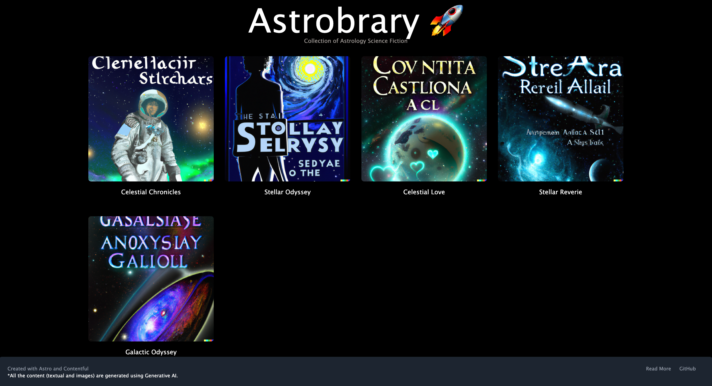
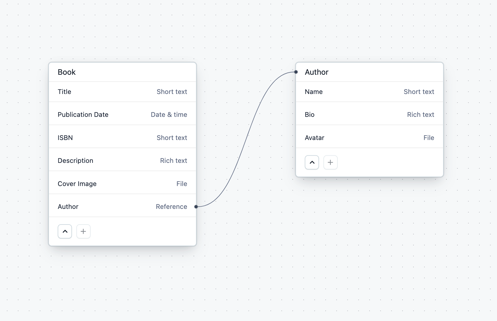
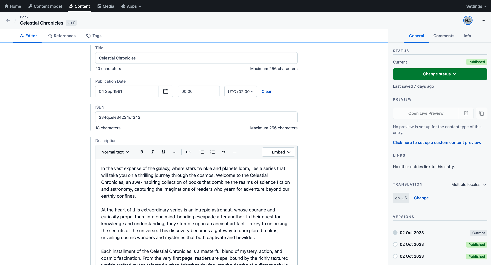

# Contentful Astro Starter

Create your bookshelf with [Contentful](https://contentful.com) and [Astro](https://astro.build/).

## Demo

[Link](https://astro-bookshelf.netlify.app/)



## Disclaimer

 All the content for this starter has been generated using Generative AI. The following [Marketplace](https://www.contentful.com/marketplace/) apps were used to generate the content:
 - [AI Content Generator](https://www.contentful.com/marketplace/app/ai-content-generator/)
 - [AI Image Generator](https://www.contentful.com/marketplace/app/ai-image-generator/)

## Features

- Simple content model and structure. Easy to adjust to your needs.
- Uses the [Contentful GraphQL API](https://www.contentful.com/developers/docs/references/graphql/) to fetch the content.
- Uses the [rich-text-html-renderer](https://www.npmjs.com/package/@contentful/rich-text-html-renderer) to render Rich Text.

## Quick Start

Follow the steps mentioned below to set up and run the project quickly. For more detailed instructions, follow the steps mentioned in [Configuration](#configuration).

### Step 1. Get the source code and install dependencies

Run the following command in your terminal to clone the Contentful Astro Starter.

```sh
npm create astro@latest -- --template contentful/starter-astro-bookshelf
```

Enter a name for your project and install the dependencies.

### Step 2. Set up the content model

The starter comes with a Contentful set up command that imports the required content model and adds sample content to your space.

The command asks you for a [Space ID](https://www.contentful.com/help/find-space-id/), [Content Management API Access Token](https://www.contentful.com/developers/docs/references/content-management-api/), and the [Conetnt Delivery API Access Token](https://www.contentful.com/developers/docs/references/content-delivery-api/).

In your terminal, navigate in to the project directory. Run the following command to set up the content model.

```sh
npm run setup
```

When prompted, enter the above mentioned details in the terminal respectively.

### Step 3. Run it locally

Execute the following command.

```sh
npm run dev
```

Navigate to `localhost:4321`` to view the site.

## Configuration

### Step 1. Create an account and a space on Contentful

First, [create an account on Contentful](https://www.contentful.com/sign-up/).

After creating an account, create a new empty **space** from the [dashboard](https://app.contentful.com/) and assign to it any name of your liking.

### Step 2. Create a content model

The [content model](https://www.contentful.com/developers/docs/concepts/data-model/) defines the data structures of your application/websites. The structures are flexible and you can tailor them to your needs.

For this example you need to create a content model that defines the author, and book. **You can create them automatically by using this starter or by doing it manually** to familiarize yourself with the Contentful user interface.


#### Create the content model manually

##### Create a `Book Author` content type

From your Contentful space, go to **Content model** and add a new content type:

- Give it the **Name** `Book Author`, the **Api Identifier** should be `bookAuthor`

Once the content model is saved, add these fields (you don't have to modify the settings unless specified):

- `Name` - **Text** field (type **short text**).
    - Under **Field Options** in Settings, check ***This field represents the Entry title***
- `Bio` - **Rich Text** field.
- `Avatar` - **Media** field.

Save the content type and continue.

##### Create a `Book Reference Page` content type

From your contentful space, go to **Content model** and add a new content type:

- Give it the **Name** `Book Reference Page`, the **Api Identifier** should be `bookReferencePage`

Once the content model is saved, add these fields (you don't have to modify the settings unless specified):

- `Title` - **Text** field (type **Short text**).
- `Publication Date` - **Date & time** field.
- `ISBN` - **Text** field (type **Short text**).
- `Description` - **Rich Text** field.
- `Cover Image` - **Media** field.
- `Author` - **References** field (type **Single references**).
    - Under **Validation**, check ***Required field***.
    - Under **Validation**, check **_Accept only specified entry type_** and select ***Author***.

### Step 3. Validate your content model

After setting up the content model, it should look as follows.

**Content model overview**



### Step 4. Populate Content

Go to the **Content** section in your space, then click on **Add entry** and select the **Author** content type:

Do this for other content types as well.

**Important:** For each entry and asset, you need to click on **Publish**. If not, the entry will be in draft state.



### Step 5. Set up environment variables

From your contentful space, go to **Settings > API keys**. There will be an example Content delivery / preview token - you can use these API keys. (You may also create a new key.)

Next, copy the `.env.example` file in this directory to `.env` (which will be ignored by Git):

```bash
cp .env.example .env
```

Then set each variable on `.env`:

- `CONTENTFUL_SPACE_ID` should be the **Space ID** field of your API Key
- `CONTENTFUL_ACCESS_TOKEN` should be the **[Content Delivery API](https://www.contentful.com/developers/docs/references/content-delivery-api/) - access token** field of your API key

Your `.env` file should look like this:

```bash
CONTENTFUL_SPACE_ID=...
CONTENTFUL_ACCESS_TOKEN=...
```

### Step 6. Run in development mode

```bash
npm install
npm run dev

# or

yarn install
yarn dev
```

Your app should be up and running on [http://localhost:4321](http://localhost:4321)!

## Deploy

Click on the button below to deploy your site to Netlify.

[](https://app.netlify.com/start/deploy?repository=https://github.com/contentful/starter-astro-bookshelf.git
)

**NOTE:** You'll have to configure the ***CONTENTFUL_SPACE_ID*** and ***CONTENTFUL_ACCESS_TOKEN*** values.
